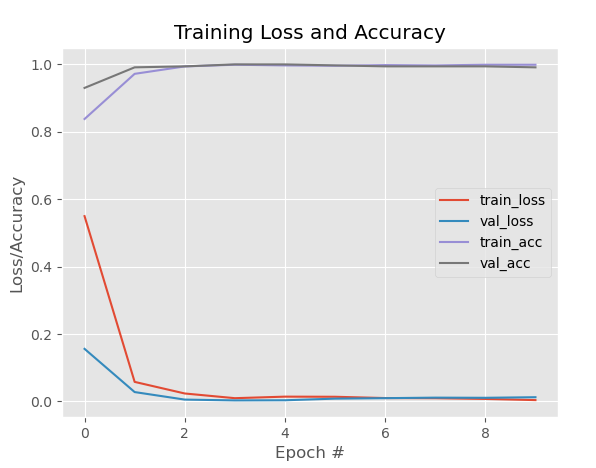

# Face-Mask-Detection-Keras
Implementing a face mask detector using Keras and OpenCV.

### Requirements:
* python3
* keras V2.4.3
* tensorflow V2.3.0
* numpy V1.18.5
* scikit-image V0.17.2
* opencv-python V4.3.0.36
* matplotlib V3.2.2
* imutils V0.5.3

### Steps to produce:
1. Train a *transfer learning* neural network to detect face masks.
2. Detect *face ROIs* from an input image using Haar Cascades.
2. Run prediction on these and evaluate and fine-tune hyperparmeters of the network.

### A Recipe for Training:
1. A Dataset
2. A loss function
3. A neural network architecture
4. An optimization method

### Dataset:
[Reference to Prajna Bhandary's Dataset:](https://github.com/prajnasb/observations/tree/master/experiements/data)

**1,376** images belonging to two classes:
* with_mask: 690 images
* without_mask: 686 images

Applying __data augmentation__ to increase the generalizability of the model
while obtaining additional traditional data. 

### CNN architecture implemented in this repository:
Fine-tuning [**Inception V3**](https://keras.io/api/applications/inceptionv3/) network structure from keras applications:
1. Replace the head of a network with a new, randomly initialized head.
2. The layers in the body of the original network are frozen.
3. Train the new FC layers until a reasonable accuracy.
4. Unfreeze the previous layers and train the entire model again.

### Regularizers

### Evaluations of the Trained Networks:
[Training Process Log: Evaluated to 99% Accuracy Average](output/trainingEval.txt)

class | precision | recall  | f1-score |  support
------| --------- | ------- | -------- |  -------
with_mask    | 0.98 | 1.00 | 0.99 | 172
without_mask | 1.00 | 0.98 | 0.99 | 172

### References:
* Deep Learning for Computer Vision with Python VOL1 & VOL2 by Dr.Adrian Rosebrock

